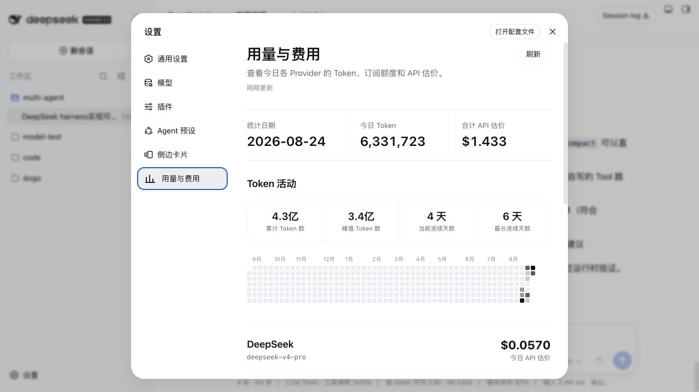
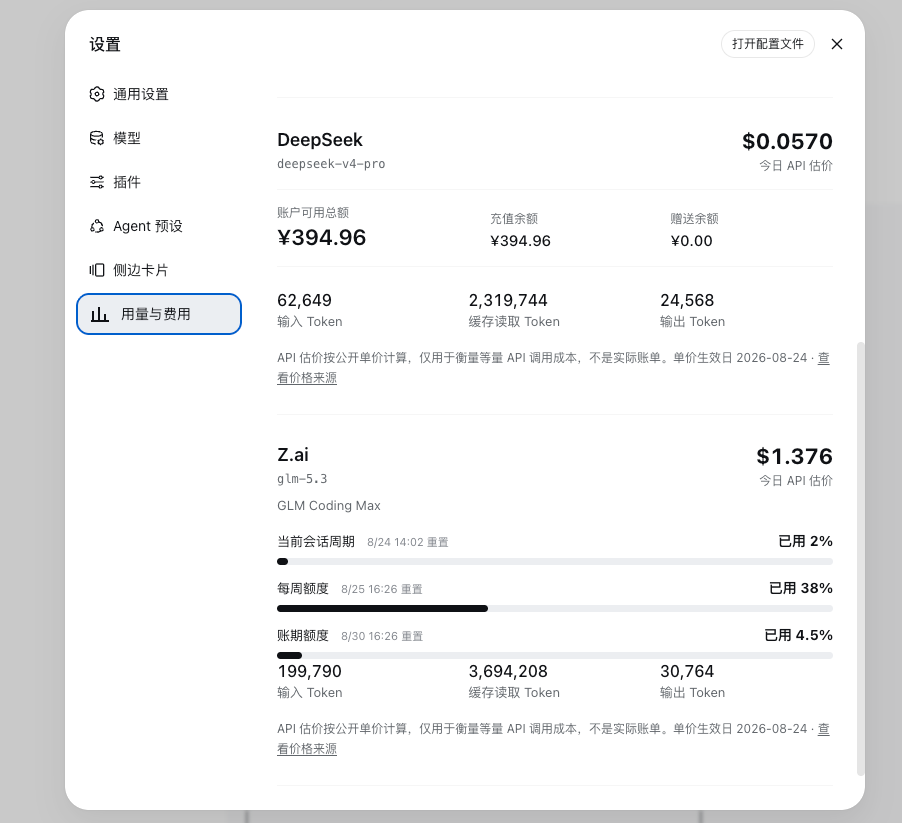

# dsh-usage-center

<p align="center">
  <a href="README.md">English</a> · <strong>简体中文</strong>
</p>

为 DeepSeek Harness Web 提供原生的用量与费用面板。插件会在 DSH 设置中新增独立的 **用量与费用** 页面，将 Provider 用量、订阅额度、账户余额、API 估价和年度活动集中展示。





## 功能

- 按 Provider 和模型展示今日输入、缓存读取和输出 Token。
- 最近 365 天 Token 活动热力图，包括累计 Token、单日峰值、当前连续天数和最长连续天数。
- DeepSeek 账户余额，包括可用总额、充值余额和赠送余额。
- Z.ai Coding Plan 当前会话周期、每周和账期额度百分比。
- 按公开模型单价计算等量 API 调用的估价。
- 使用持久化快照和 stale-while-revalidate，重复进入时立即显示数据。
- UI 支持中文和英文，并跟随 DSH 当前语言设置。
- 所有聚合均在本机完成，只提供回环地址可访问的只读接口。

## API 估价与实际扣费

API 估价回答的是：“相同 Token 用量按公开 API 单价计算需要多少钱？”它不是账单，也不会被当作订阅实际扣费。

- 按量计费 Provider 展示今日 API 估价，以及支持查询时的账户余额。
- 订阅 Provider 展示额度消耗百分比和等量 API 估价。
- 页面会直接展示价格来源链接和单价生效日期。

## 环境要求

- 支持插件的 DeepSeek Harness Web。
- Node.js `>= 22.19.0`。

## 安装

```sh
git clone https://github.com/Tieboyh/dsh-usage-center.git
cd dsh-usage-center
npm install
npm run check
dsh plugin --profile web add "$PWD"
```

安装、升级或卸载插件后需要重启 DSH Web。

## 凭据

插件复用 DSH 凭据。API Key 只由服务端进程解析，不会返回浏览器，也不会写入统计快照。

| 凭据 | 用途 |
| --- | --- |
| `DEEPSEEK_API_KEY` | 查询 DeepSeek 账户余额。 |
| `ZAI_CODING_CN_API_KEY` | 查询中国区域 Z.ai Coding Plan 的额度周期。 |
| `ZAI_API_KEY` | Z.ai Coding Plan 的备用凭据。 |
| `ZAI_API_REGION` | 可选的 Z.ai 区域覆盖配置。 |

## 数据与刷新机制

用量从本机 DSH 会话事件中聚合。同一 turn 和 step 重复上报的累计 usage 会替换旧样本，不会重复计数。

- 最近一次成功结果保存在 `<DSH_HOME>/storages/usage-center-snapshot.json`。
- 打开页面或重启 DSH 后，会立即展示当天快照。
- 快照超过一分钟时，保留现有数据并在后台刷新。
- 手动刷新期间不会清空当前页面。
- 上游余额或额度请求失败时，继续保留上一次成功快照。
- 快照包含聚合用量和已展示的余额/额度结果，但不包含 API Key。

## 隐私与安全

- 概览接口只接受来自回环地址的只读 `GET` 请求。
- 浏览器无法读取会话正文和原始事件日志。
- 凭据始终位于 DSH credentials 服务之后。
- 插件不包含外部分析或遥测。

## 开发

```sh
npm install
npm run check
npm run build
```

`npm run check` 会执行语法检查和 Node 测试。生成的 DSH 客户端与服务端 bundle 位于 `lib/`，该目录不会提交到 Git。

## 许可证

[MIT](LICENSE)
